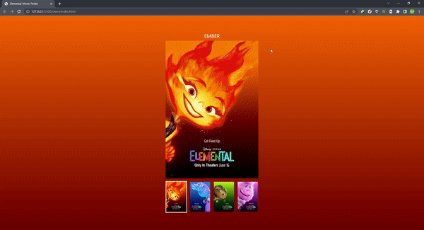

# 영화 엘리멘탈 썸네일 페이지 구현

---
<b>구현 영상</b>



---

## 🔒 요구사항

1. 이벤트 처리 방식을 사용하여 클릭 이벤트를 걸어주세요.
   a. 이벤트 위임
   b. 반복문


2. 이미지와 색상의 데이터는 `data.js` 에서 불러와주세요.


3. 각 li 항목들을 클릭하면 배경 색상과 메인 비주얼 이미지를 변경해주세요.
   a. 배경색 변경 ( colorB의 기본값은 `#000` 으로 한다 )

   ```jsx
   elem.style.background = `linear-gradient(to bottom, 'colorA','colorB')`;
   ```

   b. 이미지 변경

   ```jsx
   target.src = `./assets/${data.name}.jpeg`;
   target.alt = data.alt;
   ```

4. 비주얼이 변경되면 상단에 비주얼에 맞는 이름으로 변경해주세요.

   ```jsx
   target.textContent = data.name;
   ```

5. 함수를 분리시켜주세요.
   1. `setBgColor` 함수
   2. `setImage` 함수
   3. `setNameText` 함수
6. 가독성이 좋은 코드로 리팩토링 해주세요.

<br><br>


## 👨‍💻 구현 코드


### 초기 변수 설정

```js
//dom에 접근
const body = getNode("body");
const navigation = getNode(".nav");
const list = getNodes(".nav li");
const visualImage = getNode(".visual img");
const nickName = getNode(".nickName");
```

<br>

### 1. `setBgColor` 함수

```js
function setBgColor(node, firstColor, secondColor = "#000") {
  if (typeof node === "string") node = getNode(node);

  if (typeof firstColor !== "string" || typeof secondColor !== "string") {
    throw new TypeError(
      "setBgColor 함수의 두 번째와 세 번째 인수는 문자 타입 이어야 합니다."
    );
  }

  node.style.background = `linear-gradient(to bottom, ${firstColor},${secondColor})`;
}
```

<br>

### 2. `setImage` 함수

```js
function setImage(node, index) {
  if (typeof node === "string") node = getNode(node);

  attr(node, "src", `./assets/${data[index].name.toLowerCase()}.jpeg`);

  attr(node, "alt", data[index].alt);
}
```

<br>

### 3. `setNameText` 함수

```js
function setNameText(node, index) {
  if (typeof node === "string") node = getNode(node);

  node.textContent = data[index].name;
}
```

<br>

### 4. 이벤트 실행함수

```js
function handleSlider(e) {
  // e.preventDefault();

  const target = e.target.closest("li");

  if (!target) return;

  //이벤트 대상의 data-index값 불러오기
  const index = attr(target, "data-index");

  // 노드 리스트 순환 돌아서 각 리스트에 is-active 클래스 제거
  list.forEach((li) => removeClass(li, "is-active"));

  // 선택한 대상에 is-active 클래스 추가
  addClass(target, "is-active");

  let firstColor = data[index - 1].color[0];
  let secondColor = data[index - 1].color[1];

  setImage(visualImage, index - 1);
  setBgColor(body, firstColor, secondColor);
  setNameText(nickName, index - 1);

  // document.querySelector("h1").textContent = data[index - 1].name;
}
```

<br>


